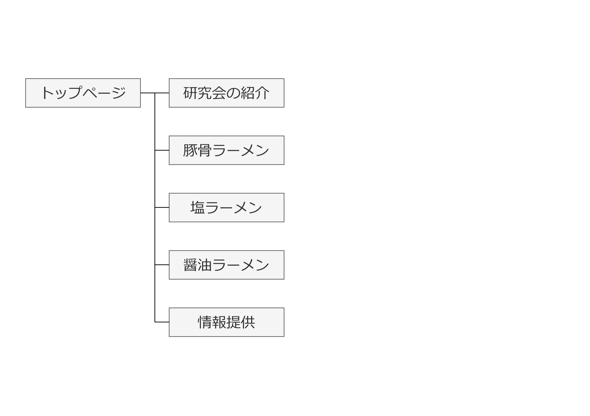

# 研究開発リテラシー　最終課題レポート
# 作成物
## Webページの概要
「ラーメン研究会」という架空の団体が存在すると想定して制作した研究会のサイト．上部及び下部のメニューからラーメンの特徴を見るページに移行し，詳細を閲覧可能である．なお，ラーメン屋の情報を収集するためのフォームを埋め込んだ情報提供ページを作成した．

## 使用技術

## サイトマップ

## Webページの外観
- （左）PC閲覧時，（右）スマートフォン閲覧時

## 動作確認環境
- Google Chrome 126.0.6478.127
- Safari 17.5　618.2.12

## 作業分担
本班ではページごとに担当を割り当て，作成を行った．
| ---- | ---- | ---- |
| ---- | ---- | ---- |
| index.html   index.css   introduction.html   introduction.css   common.html   common.css   pig-bones.html   pig-bones.css   form.html   form.css   script.js | common.html   common.css   soy-sauce.html   soy-sauce.css | common.html   common.css   salt.html   salt.css |

## アピールポイント
- 各ラーメンの紹介ページにYouTubeを埋め込んだ．
- スマートフォンでの閲覧（レスポンシブデザイン）に対応した設計とした（ハンバーガーメニュー等）．
- 「情報提供」ページではGoogle Formを埋め込んだフォームを作成した．
- UDフォントを用いることで，可読性の向上に努めた．
- favicon.ico および apple-touch-icon.png を適用することで，ブックマーク作成時やタブ表示時にアイコンが表示される仕様とした．

## まとめ
gitおよびGitHub / GitHub Desktop を用いて，共同作業によりウェブサイトを制作することができた．

------
### サイト内において使用した画像の出典
- Free1970，“湯気の上がるシズル感のあるラーメン”，Adobe Stock，2021/12/16，https://stock.adobe.com/jp/images/%E6%B9%AF%E6%B0%97%E3%81%AE%E4%B8%8A%E3%81%8C%E3%82%8B%E3%82%B7%E3%82%BA%E3%83%AB%E6%84%9F%E3%81%AE%E3%81%82%E3%82%8B%E3%83%A9%E3%83%BC%E3%83%A1%E3%83%B3/475295560?prev_url=detail，（参照2024/06/17）
- Ski14，“noodle, ramen, mie icon”，Adobe Stock，https://stock.adobe.com/jp/images/noodle-ramen-mie-icon/533536429?prev_url=detail&asset_id=533536429，（参照2024/06/17）
- Nishihama，“とんこつラーメン　Tonkotsu Ramen”，Adobe Stock，2021/01/12，https://stock.adobe.com/jp/images/tonkotsu-ramen/404745855?prev_url=detail，（参照2024/06/17）
- photo3idea，“ramen”，Adobe Stock，，https://stock.adobe.com/jp/images/ramen/474484374?prev_url=detail&asset_id=474484374，（参照2024/06/17）
- Free1970，“湯気の上がるシズル感のあるラーメン”，Adobe Stock，2022/01/14，https://stock.adobe.com/jp/images/%E6%B9%AF%E6%B0%97%E3%81%AE%E4%B8%8A%E3%81%8C%E3%82%8B%E3%82%B7%E3%82%BA%E3%83%AB%E6%84%9F%E3%81%AE%E3%81%82%E3%82%8B%E3%83%A9%E3%83%BC%E3%83%A1%E3%83%B3/480344673?prev_url=detail，（参照2024/06/17）
- Nishihama，“塩ラーメン　Shio Ramen”，Adobe Stock，2020/06/02，https://stock.adobe.com/jp/images/shio-ramen/354777371?prev_url=detail，（参照2024/06/17）
- sasazawa，“豚骨ラーメン”，Adobe Stock，2020/10/10，https://stock.adobe.com/jp/images/%E8%B1%9A%E9%AA%A8%E3%83%A9%E3%83%BC%E3%83%A1%E3%83%B3/384518990?prev_url=detail，（参照2024/06/17）
- ISHI，“ラーメン　中華そば　醤油ラーメン　中華ラーメン”，Adobe Stock，2021/12/30，https://stock.adobe.com/jp/images/%E3%83%A9%E3%83%BC%E3%83%A1%E3%83%B3%E3%80%80%E4%B8%AD%E8%8F%AF%E3%81%9D%E3%81%B0%E3%80%80%E9%86%A4%E6%B2%B9%E3%83%A9%E3%83%BC%E3%83%A1%E3%83%B3%E3%80%80%E4%B8%AD%E8%8F%AF%E3%83%A9%E3%83%BC%E3%83%A1%E3%83%B3/478152668?prev_url=detail，（参照2024/06/17）
